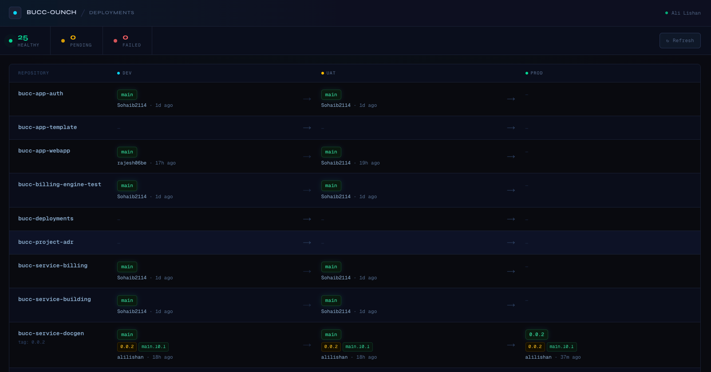
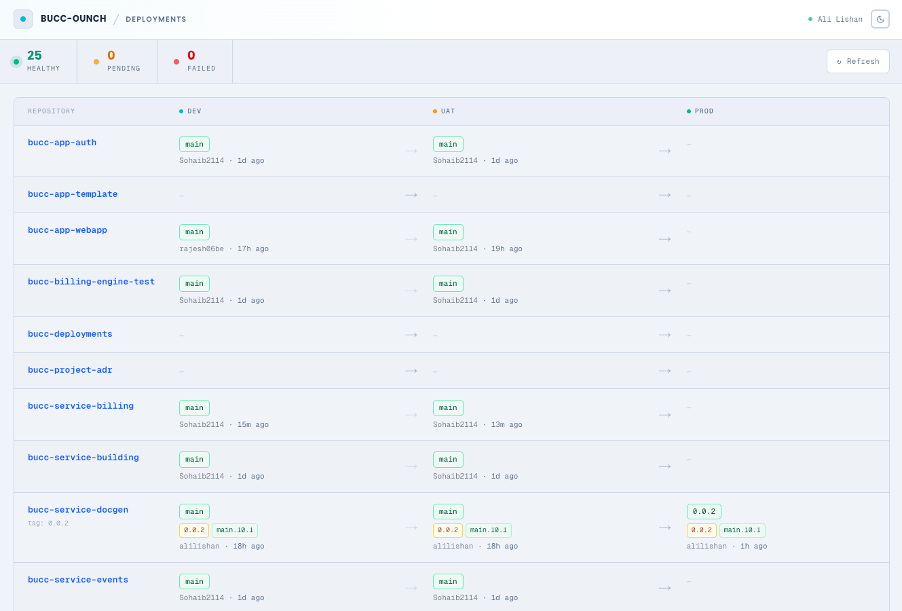
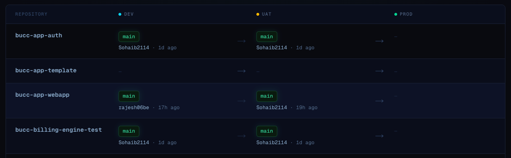
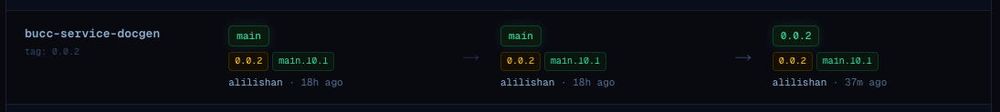
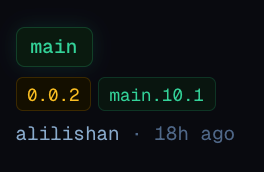
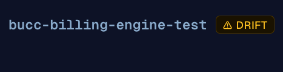
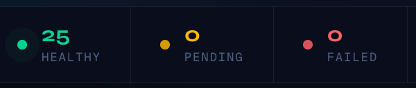

# Org Deployment Monitor

A high-signal deployment status dashboard for GitHub organisations. One table, every repository, every environment — with live container image tracking and drift detection.





---

## Overview

Deployment Monitor gives your engineering team a single-pane-of-glass view of what is running where. It reads your GitHub deployments and GHCR container images server-side on every request so the data is always live — no background jobs, no webhooks, no database.

### The pipeline view

Each row is a repository. Each column is an environment (dev → uat → prod). At a glance you can see:

- Which version is deployed in each environment
- Whether the container image tag matches across environments (**image drift**)
- Who deployed it and when
- What image tags are currently active in each environment



---

## Features

### Deployment pipeline table

A single table shows every repository across every environment. Environment columns are ordered dev → uat → prod with arrow connectors between them. The connector fades out when adjacent environments are on the same version.



### Colour-coded image tags

Container image tags pulled from GHCR are displayed as colour-coded badges directly in each environment cell:

| Colour | Meaning |
|--------|---------|
| 🟢 Green | Built from `main` branch — stable, expected path |
| 🟡 Amber | Semver release tag (`1.2.3`, `v0.0.2`) — pinned version |
| 🔴 Red | Feature branch build or other — worth investigating |



### Image drift detection

When different environments are running images built from different commits, an **⚠ drift** badge appears next to the repository name. This catches cases where dev and prod have diverged silently.



### Deployment status badges

Each environment shows the current deployment status:

- **Green** — last deployment succeeded
- **Amber pulsing** — deployment in progress
- **Red** — last deployment failed
- **Dim** — no deployment recorded

Clicking a status badge opens the GitHub deployment activity log for that environment.

### Summary bar

The top bar shows the total count of healthy, pending, and failed deployments across all repositories and environments at a glance.



### One-click refresh

The Refresh button revalidates all data via a Server Action without a full page reload. A spinner shows while data is fetching.

---

## Tech stack

| Layer | Technology |
|-------|-----------|
| Framework | [Next.js 16](https://nextjs.org) — App Router, Server Components, Server Actions |
| Auth | [NextAuth v5](https://authjs.dev) — GitHub OAuth, token stored in session JWT |
| Styling | [Tailwind CSS v4](https://tailwindcss.com) |
| Components | [shadcn/ui](https://ui.shadcn.com) New York style (`@base-ui/react`) |
| Fonts | [Syne](https://fonts.google.com/specimen/Syne) (headings) · [Geist Mono](https://vercel.com/font) (data) |
| Testing | [Vitest](https://vitest.dev) |
| Language | TypeScript |

### Architecture

All data fetching happens server-side on every request. There is no client-side polling, no WebSocket, no database, and no background jobs. The GitHub API is called directly using the authenticated user's OAuth token.

```
Browser → Next.js Server Component
             │
             ├─ GitHub Deployments API   (per repo, parallel)
             ├─ GitHub Tags API          (per repo, parallel)
             └─ GHCR Packages API        (per org, then per package)
```

The session JWT carries the GitHub OAuth access token (scoped to `read:org repo read:packages`). On sign-out the token is discarded.

---

## Setup

### 1. Clone

```bash
git clone git@github.com:alilishan/Org-Deployment-Monitor.git
cd Org-Deployment-Monitor
npm install
```

### 2. Create a GitHub OAuth App

Go to **GitHub → Settings → Developer Settings → OAuth Apps → New OAuth App**.

| Field | Value (local dev) |
|-------|-------------------|
| Application name | Deployment Monitor (dev) |
| Homepage URL | `http://localhost:3000` |
| Authorization callback URL | `http://localhost:3000/api/auth/callback/github` |

Copy the **Client ID** and generate a **Client Secret**.

> For production, create a separate OAuth App with your real domain as the callback URL.

### 3. Configure environment variables

```bash
cp .env.local.example .env.local
```

Edit `.env.local`:

```env
GITHUB_CLIENT_ID=your_client_id
GITHUB_CLIENT_SECRET=your_client_secret
AUTH_SECRET=                        # run: openssl rand -base64 32
```

### 4. Point at your organisation

Open `src/lib/github.ts` and update the default org:

```ts
export async function fetchDashboard(token: string, org = "YOUR-ORG-NAME")
```

If you use the cleanup script, update the matching constant in `scripts/cleanup-envs.mjs` too:

```js
const ORG = "YOUR-ORG-NAME"
```

### 5. Run

```bash
npm run dev
```

Open [http://localhost:3000](http://localhost:3000) and sign in with a GitHub account that has access to the organisation.

---

## Environment variables

| Variable | Required | Description |
|----------|----------|-------------|
| `GITHUB_CLIENT_ID` | ✅ | GitHub OAuth App client ID |
| `GITHUB_CLIENT_SECRET` | ✅ | GitHub OAuth App client secret |
| `AUTH_SECRET` | ✅ | Random 32-byte secret for NextAuth session encryption. Generate with `openssl rand -base64 32` |

Never commit `.env` or `.env.local`. Both are gitignored.

---

## GHCR image tag mapping

The dashboard maps GHCR container tags to environments using these marker tags:

| Environment | Marker tag |
|-------------|-----------|
| `dev` | `dev` |
| `uat` | `uat` |
| `prod` | `latest` |

Any image version that carries a marker tag is shown in the corresponding environment column. Version tags (e.g. `main.10.1`, `0.0.2`) are displayed as badges; marker tags and SHA digests are filtered out.

One image digest can carry multiple environment markers at once. In that case the same version tags appear in all matching environment columns, and the drift detector will not flag them as drifted.

---

## Scripts

```bash
# Development
npm run dev          # start dev server at http://localhost:3000
npm run build        # production build
npm start            # run production build locally

# Testing
npm test             # run Vitest unit tests (15 tests)
npm run test:watch   # watch mode

# Maintenance — delete stale GitHub environments (outside dev/uat/prod)
GITHUB_TOKEN=ghp_xxx node scripts/cleanup-envs.mjs --dry-run   # preview
GITHUB_TOKEN=ghp_xxx node scripts/cleanup-envs.mjs             # delete
```

The cleanup script requires a Personal Access Token (not the OAuth App secret) with `repo` scope. GitHub requires a deployment to be marked inactive before deletion; the script handles this automatically.

---

## Adding screenshots

Screenshots live in `docs/screenshots/`. To add them:

1. Run `npm run dev` and sign in
2. Capture the following views and save them at the paths below:

| File | What to capture |
|------|----------------|
| `docs/screenshots/dashboard.png` | Full dashboard in dark mode |
| `docs/screenshots/lightmode.png` | Full dashboard in light mode |
| `docs/screenshots/pipeline-view.png` | A few rows of the table showing dev → uat → prod flow |
| `docs/screenshots/table-detail.png` | A single row with all columns visible |
| `docs/screenshots/tag-badges.png` | Close-up of an env cell showing green/amber/red tag chips |
| `docs/screenshots/drift-badge.png` | A row with the ⚠ drift badge visible |
| `docs/screenshots/summary-bar.png` | The summary bar with healthy/pending/failed counts |

Recommended tool on macOS: `Cmd + Shift + 4` for selection capture. Aim for ~1400px wide at 2× retina for sharp rendering in GitHub's Markdown viewer.

---

## License

MIT
